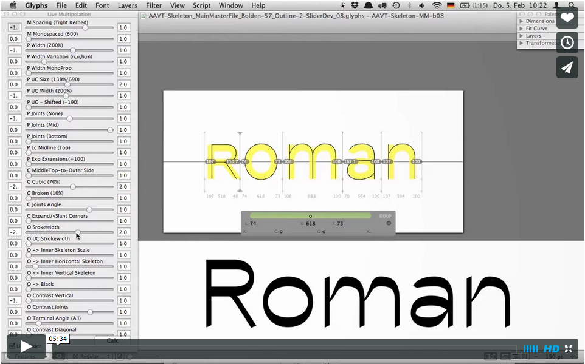

# Experimental Parametric Typeface Glyphs

  
https://vimeo.com/118806744

1. copy .py File to Glyphs script folder
2. Open .Glyphs file
3. Run “Parametric Typeface AAVT-MM-Outline”
4. Have Fun 
  
  
   
   
**Trouble shooting**
- this version only works in Glyphs 2.0 (although since 2.0 the spacing axis is not working anymore)
- make sure the “Vanilla” is installed (go to Glyphs > Preferences > Addons > Modules and click the Install Modules button)
- if the sliders wont show up again, try to remove the all the current instances

**Copy Right**
- Attribution only. [CC-BY-2.0](https://creativecommons.org/licenses/by/2.0/)
